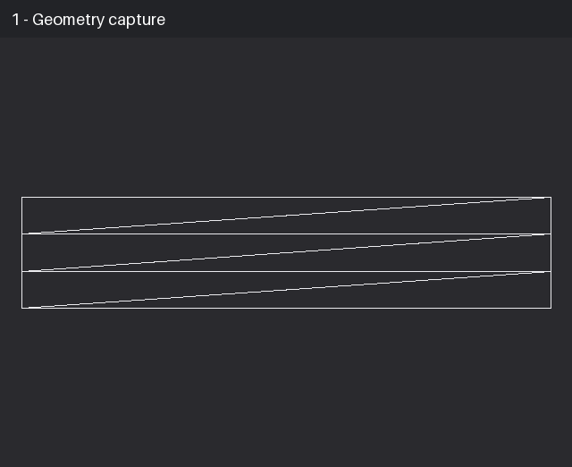
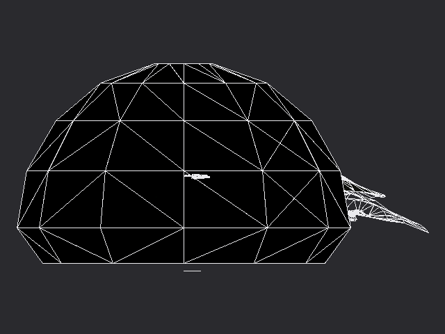

# Initial D Arcade Stage 3 — Native SH-4 Recompilation (WIP)

<p align="center">
  
</p>

An experimental static ahead-of-time recompilation project for the NAOMI 2 release of *Initial D Arcade Stage 3* (GDS-0033).

> **Research status:** this is not an emulator, a finished port, or a playable game distribution. The public repository contains original infrastructure, selected source snapshots, tests, and truthful progress evidence. It contains no game image, BIOS, PIC/CHD data, extracted assets, private HOSTFS overlay, memory snapshot, or generated game-code translation.



The GIF shows separate diagnostic milestones from the native path. It is not a simulated continuous gameplay recording.

## What works today

- The SH-4 decoder/code generator translates the currently exercised program paths to native C++ ahead of time, including FPSCR-aware floating-point register width and bank handling.
- The validated boot path runs through direct translated functions with no SH-4 interpreter or JIT fallback.
- The stripped native ELAN core now walks bounded `Link` and `Model` streams, preserves raw TA record alignment, executes recognized waits and texture-DMA events, rejects malformed input fail-closed, and reports zero walk failures on the accepted native boot trace.
- The accepted native-boot trace recorded 1,566 observed and 1,566 handled ELAN submissions with zero rejected commands.
- A missing private credit-screen asset set was traced to a zero-record allocation and later heap overwrite. Supplying the four files from the owner's legally held disc image made both constructions allocate 25 records (2,000 bytes) and removed the heap corruption. Those files are not included here.
- The boot sequence now finishes the timed frontend transition and keeps the course/attract component running. A post-fix capture contained 41,515 vertices, 29,389 triangles, 208 textured batches, and 44 decoded textures.
- The latest full-scene diagnostic capture contained 48,686 vertices and 33,810 triangles across 620 accepted batches.
- Earlier deterministic intro validation reproduced an identical frame SHA-256 on another machine: `34D6B91C0550A5CC2A60D4B1F8930812908CEA6DCD6C354749A0881BE426D9E2`.

## What does not work yet

- The result is not start-to-finish playable.
- The active course scene currently has no associated projection record in the diagnostic renderer (`projection=0`). The latest output therefore looks like raw/faceted scene geometry rather than a correct in-game camera view.
- Plain PVR/TA 2D lists still need correct execution and compositing over ELAN 3D.
- Twenty-one batches in the latest full-scene diagnostic capture were rejected instead of being guessed through.
- Complete audio, controls, menus, races, save/configuration paths, performance work, and release packaging remain unfinished.
- Whole-game translation coverage is not claimed; unvisited paths can expose additional indirect targets or instruction-semantic issues.



This image is useful proof that the native course component is producing substantial scene data, but it is not a finished gameplay frame. Camera/projection association is the immediate graphics blocker.

See [STATUS.md](STATUS.md) for the evidence ledger, [ROADMAP.md](ROADMAP.md) for ordered acceptance criteria, and [docs/MILESTONE_V1400.md](docs/MILESTONE_V1400.md) for the latest investigation notes.

## Repository contents

- `translator/` — general SH-4 instruction decoding and C++ statement generation.
- `src/runtime/` — selected clean-room runtime snapshots for ELAN, JVS, geometry observation, and diagnostic rendering.
- `tests/` — public synthetic tests that require no game data.
- `tools/` — small utilities for producing labeled diagnostic media.
- `docs/` — architecture, legal attribution, milestone notes, and progress media.

The complete private integration runtime and generated translation units are intentionally absent. This repository is an auditable progress package, not a standalone game target.

## Run the public checks

Python translator tests:

```bash
python -m unittest discover -s tests -v
```

Native ELAN classifier/walker smoke test:

```bash
cmake -S . -B build
cmake --build build
ctest --test-dir build --output-on-failure
```

No proprietary input is needed for either check.

## Project boundary

This project is a native static-AOT port. No interpreter or JIT fallback is accepted as a completion path, and diagnostic failures must remain visible rather than being bypassed.

This independent research project is not affiliated with or endorsed by Sega, Kodansha, Shuichi Shigeno, or the original developers and publishers. All referenced names and trademarks belong to their respective owners.
