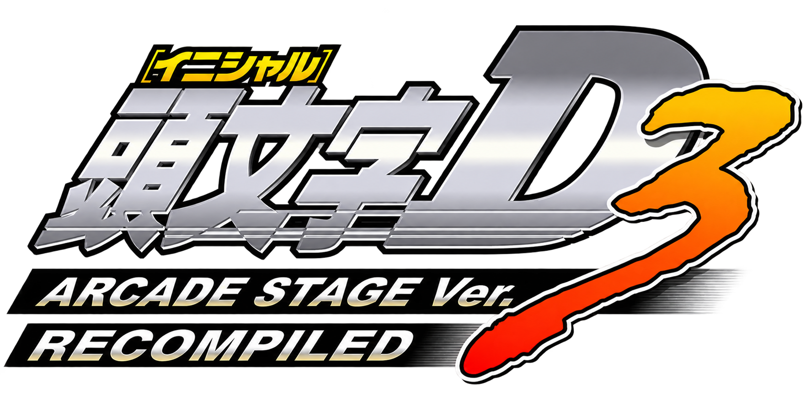
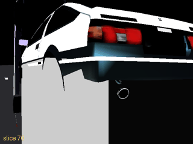
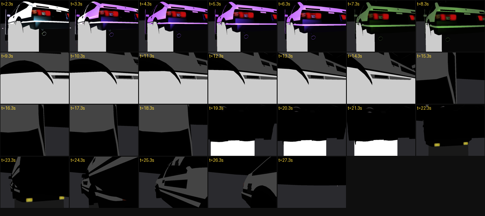

# Initial D Arcade Stage 3 — Native SH-4 Recompilation (WIP)

<p align="center">
  
</p>

An experimental static ahead-of-time recompilation project for the NAOMI 2 release of *Initial D Arcade Stage 3* (GDS-0033).

> **Research status:** this is not an emulator, not a finished port, and not a playable game distribution. The public repository contains original clean-room infrastructure and progress evidence only. It contains no game image, BIOS, PIC/CHD data, extracted assets, memory snapshots, or generated game-code translation.



## What works today

- A Python SH-4 decoder/code generator covers the instruction families exercised by the current static-AOT path, including FPSCR-aware floating-point register width and bank handling.
- Native C++ execution reaches deterministic boot/attract-mode replay checkpoints with direct translated-function dispatch and no interpreter or JIT fallback.
- A clean-room ELAN command decoder and diagnostic renderer reproduce about 53 seconds of the intro's 3D cinematography: shot changes, animated lighting, multiple cars, and the two-car chase sequence.
- Cross-machine N70 validation reproduced an identical rendered-frame SHA-256: `34D6B91C0550A5CC2A60D4B1F8930812908CEA6DCD6C354749A0881BE426D9E2`.
- Narrow device seams exist for ELAN command classification, JVS I/O, and the AICA bootstrap handshake.
- The current v1335 work-in-progress recognizes all five observed ELAN `RegisterWait` list-complete masks, with a focused Windows test passing.



## What does not work yet

- The result is not a start-to-finish playable build.
- Submitted ELAN `Link` streams still need a bounded native walk so embedded `RegisterWait` records execute at the real command boundary.
- The frame lifecycle currently stalls around stage 112 on the new native submission path; acceptance requires real waits, CH2 DMA kicks, request-slot completion, and producer progress.
- Plain PVR/TA 2D lists are not yet composited over ELAN 3D, so title/logo cards and several overlays are missing.
- Audio beyond the bootstrap-ready seam, complete controls, whole-game coverage, and presentation polish remain incomplete.
- Some sky/road texture evidence depends on private pre-capture state and must never be fabricated or redistributed.

See [STATUS.md](STATUS.md) for the evidence ledger and [ROADMAP.md](ROADMAP.md) for ordered acceptance criteria.

## Repository contents

- `translator/` — general SH-4 instruction decoding and C++ statement generation.
- `src/runtime/` — selected clean-room runtime snapshots for ELAN and JVS work.
- `tests/` — public tests that require no game data.
- `docs/` — architecture, media, and validation notes.

The renderer snapshot is included to show the real integration work, but the complete private runtime and generated translation units are intentionally absent. It is therefore not a standalone game build target.

## Run the public checks

Python translator tests:

```bash
python -m unittest discover -s tests -v
```

Native ELAN classifier smoke test:

```bash
cmake -S . -B build
cmake --build build
ctest --test-dir build --output-on-failure
```

No proprietary input is needed for either check.

## Project boundary

this is a native static-AOT port

This independent research project is not affiliated with or endorsed by Sega, Kodansha, Shuichi Shigeno, or the original developers and publishers. All referenced names and trademarks belong to their respective owners.
