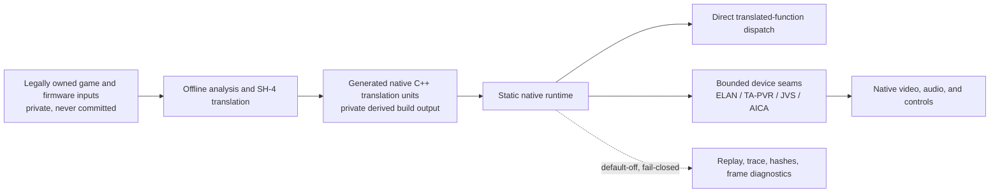

# Architecture

The design is a static recompilation pipeline, not a general-purpose NAOMI emulator.

## Translation layer

`translator/sh4recomp.py` decodes SH-4 instruction words. `translator/codegen.py` converts decoded operations into explicit C++ statements against an `SH4Context`. The private integration tree groups translated functions and dispatch tables into native translation units.

The intended end state is coherent whole-function/table AOT output with direct calls. Unknown targets remain visible errors; they are not silently interpreted.

## Runtime state

The native runtime models the SH-4 context, memory aliases, interrupts, DMA, timers, store queues, and only the hardware-facing behavior needed by the translated program. Compatibility hooks are opt-in diagnostic seams, not a second execution engine.

## Graphics split

NAOMI 2 graphics require two cooperating paths:

1. ELAN transforms, lighting, materials, instances, links, and generated geometry.
2. The PowerVR/TA path receives polygon and sprite lists, including the 2D title/logo layers.

The current diagnostic renderer proves substantial ELAN 3D behavior. The next critical step is completing submitted ELAN link execution and then activating TA/PVR list compositing at the frame boundary.

## Validation philosophy

Every semantics change is checked against bounded replay gates: accepted slices, zero unimplemented instructions, zero FPSCR drift, no faults/watchdogs, stable provenance, and deterministic hashes. Diagnostic options must be default-off and must not mutate guest-visible state unless they implement a proven device result.
